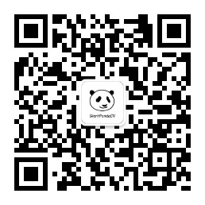

微信公众号：GiantPandaCV

**GiantPandaCV** 。专注于机器学习、深度学习、计算机视觉、图像处理等多个方向技术分享。团队成员由获取**国际** **ImageNet 2015 视觉识别挑战赛 11 名**， 曾就职**微软亚洲研究院**的梁德澎；**数学建模国家一等**，**全国高校计算机能力挑战赛人工智能赛道一等奖**的国防科大研究生 pprp ；曾获 **ACM 金牌**， **CSDN 博客访问量 近100W** 的 BBuf 组成。近一年以来已更新 **343 篇原创技术文章**。我们编写了 **《从零开始学习YOLOv3》** 、**《从零开始学习SSD》** 、**《Faster R-CNN原理和代码讲解》** 、**《多目标跟踪快速入门》，《从零开始学CenterNet》**等系列原创电子书，关注后回复对应关键字即可**免费领取**。

希望在传播知识、分享知识的同时能够启发你，大家一起共同进步，微信扫码关注我们哦~

 
